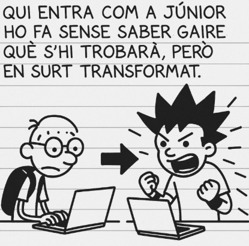

# PROJECTE-4
**EverPia 3: “Sobreviure en una empresa IT”**

Després de setmanes convivint amb el ritme imprevisible d’una consultora tecnològica, arriba al **darrer capítol de la trilogia EverPia**. És un moment que combina entusiasme, maduresa i una sensació molt real: **aquesta etapa s’acaba, i comença alguna cosa nova**.

A les consultores, la trajectòria professional segueix un patró gairebé universal: 

**Qui entra com a júnior ho fa sense saber gaire què s’hi trobarà, però en surt transformat**.  

De sobte et veus apagant incendis, assumint tasques que no surten al contracte, donant suport a companys amb més anys que tu, resolent problemes d’origen desconegut i aprenent a una velocitat que no apareix a cap manual.

* Aquesta intensitat et fa créixer.  
* Aquesta pressió et defineix.  
* Aquesta experiència accelerada et converteix en professional.

I un dia, sense adonar-te’n, descobreixes que **ja no ets el mateix júnior que va entrar per la porta amb por i il·lusió**. Ara tens eines, criteri, documentació pròpia i una manera de mirar els problemes que només es guanya treballant molt i en silenci.

# Tasques del projecta

[T01: DRP: còpies de seguretat. Estudi cas client](Tasca01/readme.MD)

[T02: DPR: còpies de seguretat. Cas pràctic](Tasca02/readme.MD)

[T03: Pla de recuperació davant desastres: imatges del sistema](Tasca03/readme.MD)

[T04: Accés remot](Tasca04/readme.MD)

[T05: Accés Remot. Connexió via SSH](Tasca05/readme.MD)

[T06: Accés remot. Escriptori remot (RDP)](Tasca06/readme.MD)

[T07: Accés remot. Serveis d’assistència remota](Tasca07/readme.MD)

[T08: Auditoria de Qualitat i Estandardització de Servidors](Tasca08/readme.MD)

[T09: Servidor fitxers Linux](Tasca09/readme.MD)

[T10: Servidor impressió Linux. CUPS](Tasca10/readme.MD)

[T11: Introducció a Figma: nocions bàsiques de disseny d’interfícies](Tasca11/readme.MD)

[T12: Fonaments del Disseny Web Comercial: Landing Page + Procés de Checkout](Tasca12/readme.MD)

[T13: Disseny d’un E-commerce en Figma (Landing Page + Checkout)](Tasca13/readme.MD)

[T14: Sostenibilitat. Prova Escrita](Tasca14/readme.MD)

[T15: Com de circular és la meva família professional?](Tasca15/readme.MD)

---

# Producte final

[P01: GitHub. Treballant de forma col·laborativa: forks i pull request.](P01/readme.MD)

[P02: Presentació i Projecció de la Maqueta al Client](P02/readme.MD)

[P03: Kanban del projecte](P03/readme.MD)
