# Part 1: Còpia seguretat dels equips clients Windows

Per arrancar hem de instalar una maquina client windows que ha de tindre un disc principal on estara el sistema operatiu i despres crearem un altre de 10 Gb on alla farem la copia

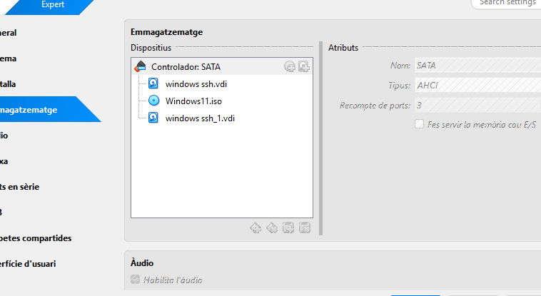


Quan ja ho tenim fet  el seguent pas sera iniciar el disc, per fer-ho el primer pas sera inicar la maquina i obrir l'administrador de disc.

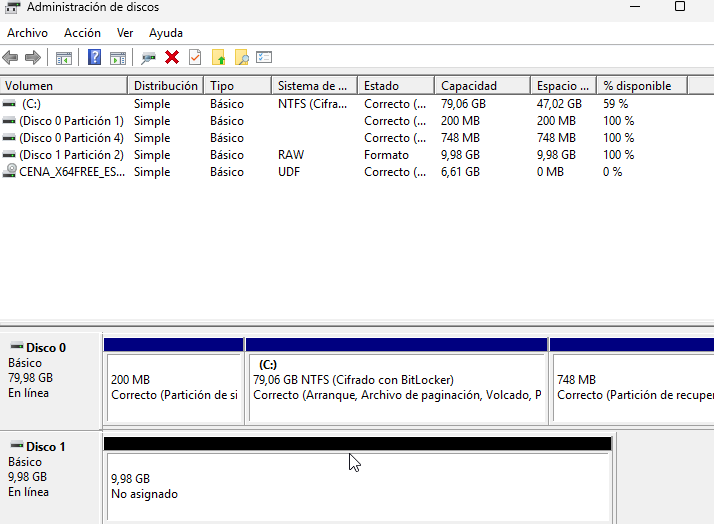


Quan hem acabat aixo el seguent pas sera crear un volum simple en el disc,hem de donarli sobre el disc i seguidament posarem "Nuevo volumen simple"

Seguidament s'iniciara una finestra en la que nomes farem siguiente siguiente fins que es crei el volum i s'ha de veure aixi

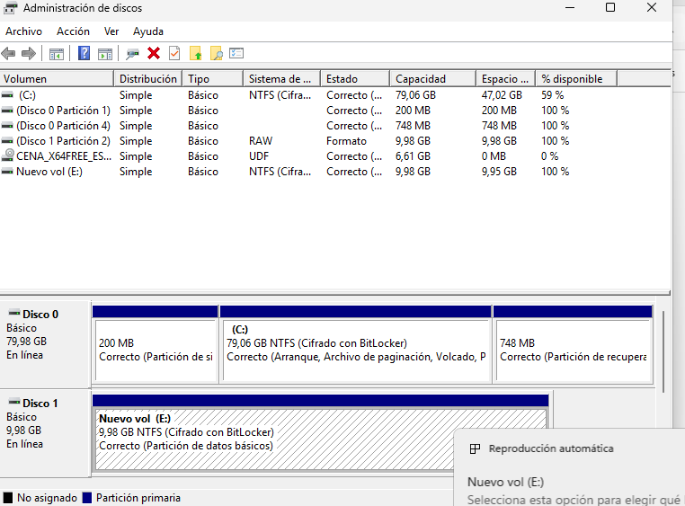


Ara hem  d'instalar duplicati, amb aquest enllaç

[Link de descarrega](https://duplicati.com/download)

Hem d'instalar la versio adequada que sera windows

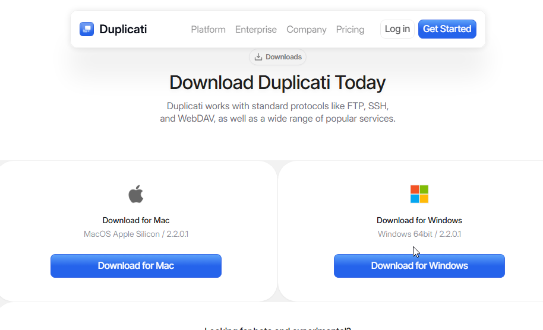

Quan estigui instalat el archiu.exe l'obrirem i li donarem seguent 2 vegades, també tindrem que acceptar tots els termes necessaris

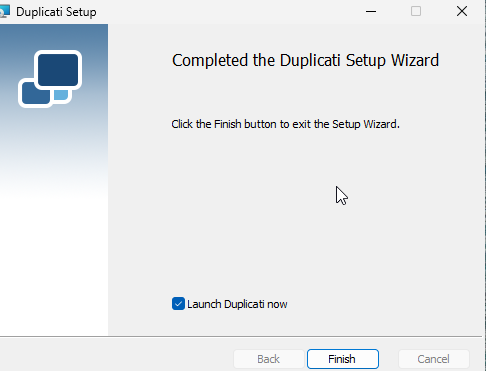

Quan s'instali, s'obrira una finestra en el nostre navegador i tindrem que posar una contrasenya

Podem posar la contrasenya al nostre gust.


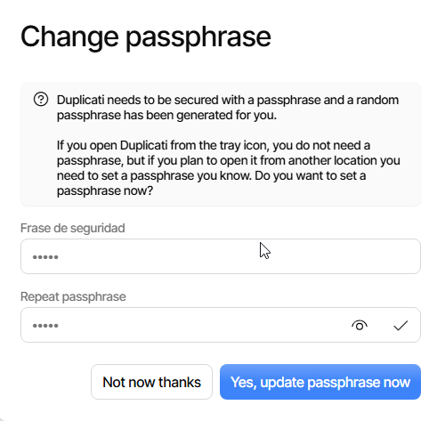

Quan ja estigui tot instalat i tot configurat hem de crear uns cuants documents per fer la copia de seguretat

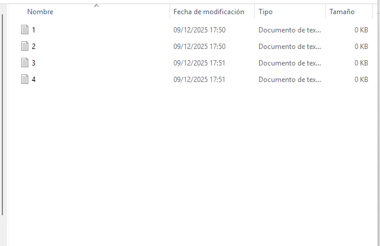

Ara hem de configurar les copies de seguretat dessitgades, hem de escollir la opcio de backup add i add new backup,

Quan estiguem alla hem de colocar les dades de la nostra copia 

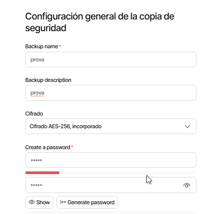

Seguidament tindrem que escollir on es guardara la copia, en el  meu cas jo la guardare en el disc 2

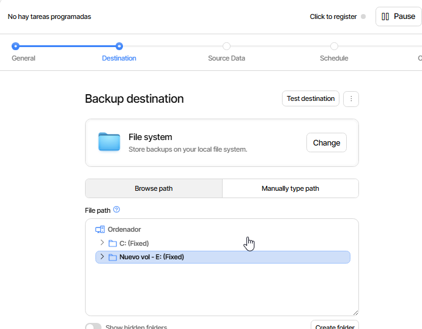

Quan hem fet aixo ara hem d'escollir amb quins documents volem realitzar la copia
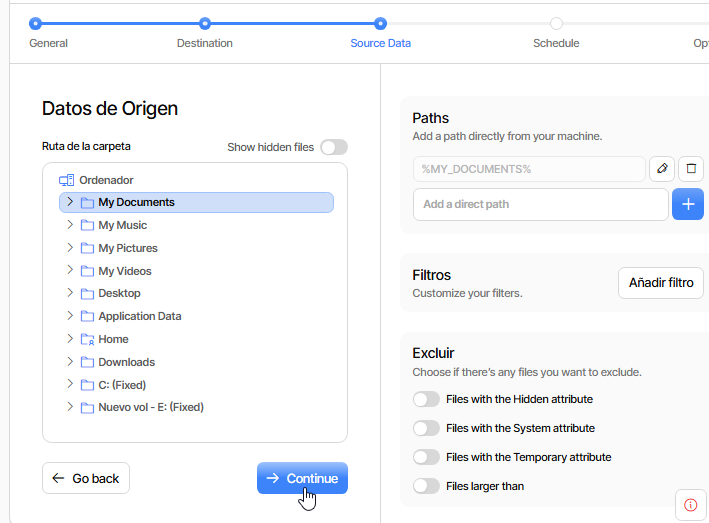

Ara hem de escollir cada quant temps volem que es realitzi la copia, la hem de fer cada hora

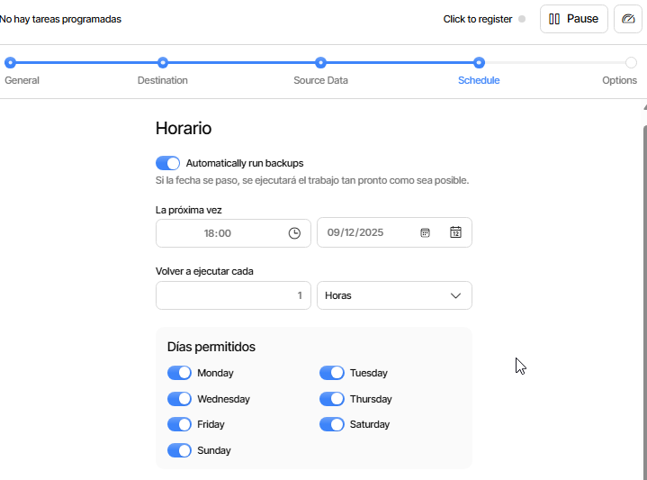

Quan arribem aqui ara nomes hem d'escollir les opcions que digui a la guia,i ja estaria la nostra copia

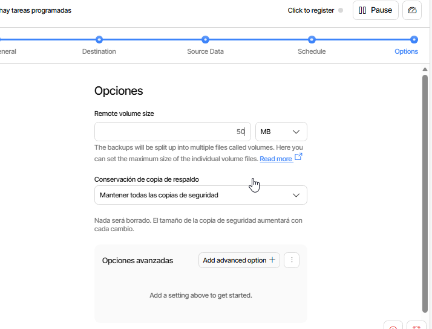

Ara basicament hem de fer el mateix però lo unic que cambia es que farem la copia al nuvol, sobre tot hem de fer servir el google drive, per realitzar-ho hem de fer aixo el però unicament modificarem el que dire ara?

El lloc on guardem la copia haurem de vincular el nostre compte, per realitzar-ho hem de seleccionar a AuthID

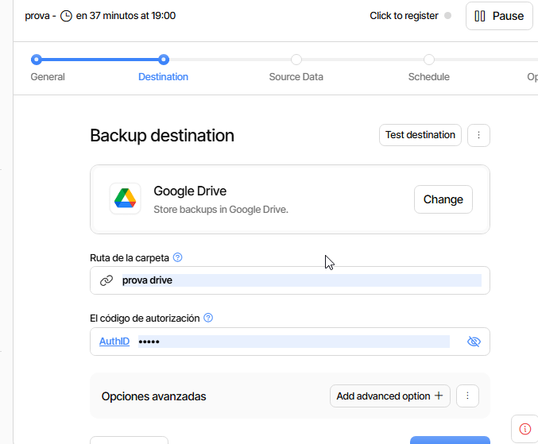

També tindrem que editar la hora en la que es repeteix de nou, ara la posarem cada dia a las 6 de la tarda

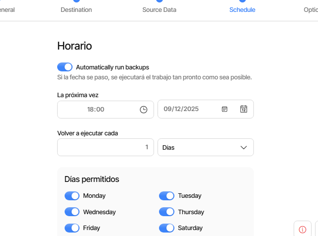

Quan hem realitzat tots els pasos ja estarien les dos copies

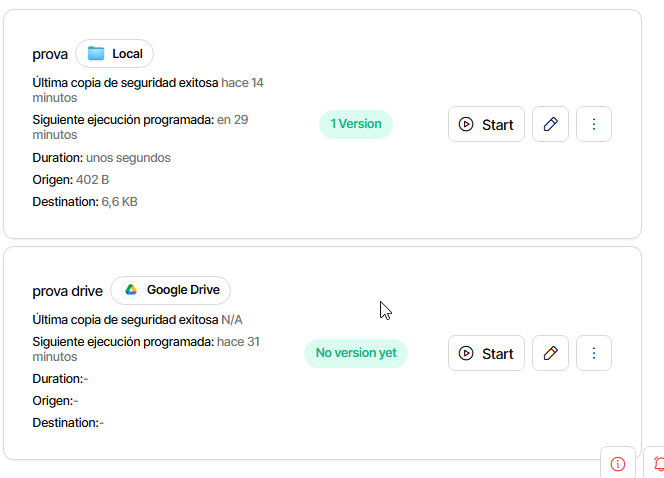

Ara hem de borrar els documents que hem realiotzat abans de prova per aixi veure si podem fer la copia correctament 

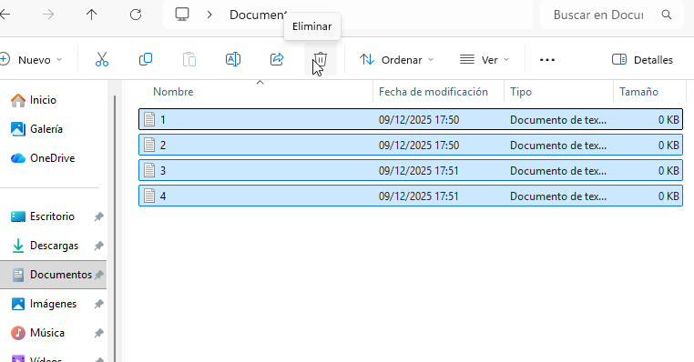
Quan ja hem borrat els dopcuments, ara seguidament recuperarem la copia, per fer aquesta tasca hem d'anar a "Restores" i seguidament li donarem a"Start"

Ara hem d'escollir quina volem restaurar, hem de posar la de proba

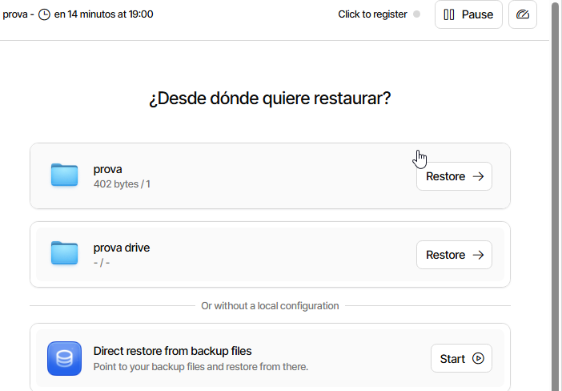

I també hem d'escollir els fitxers.

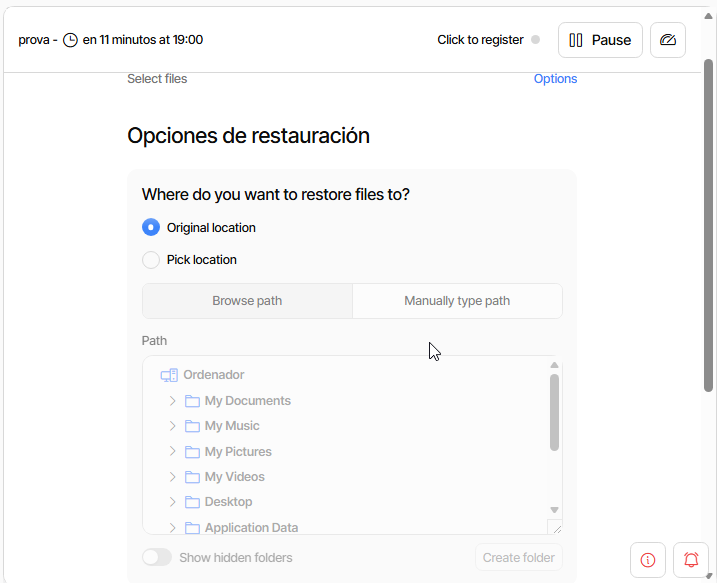

Ara li donarem seguent i ja tindrem la restauració feta

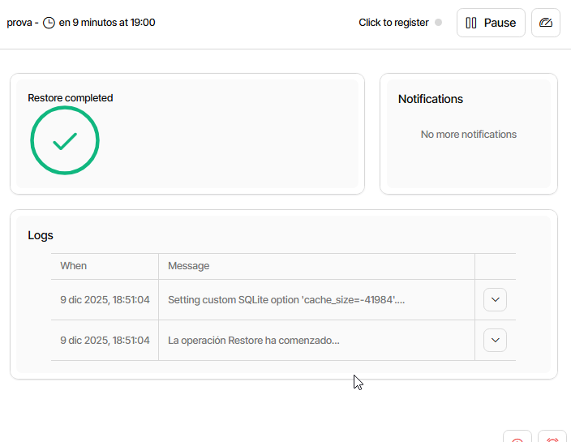

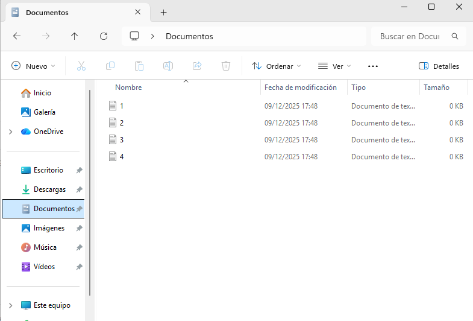

Per poder restaurar la copia de google drive hem de seguir els mateixos pasos que l'altre

---

Part 2: Còpia seguretat servidor Linux

Per fer la 2 part hem de fer instalar una maquina linux, utilitzarem una ubuntu server per realitzar la tasca

Primer de tot hem de tindre totes les actualitzacions al dia

```bash
sudo apt update && sudo apt upgrade -y 
```

Amb el duplicity farem les copies en local i en remot

Es necessari tindre un disc de 10gb per realitzar la guia,aixi que el tindrem que fer

Quan ja hem fet el disc,li hem de donar un format, li hem de donar el format xfs i muntarem al disc a la ruta ara hem de crear la ruta , ara us ensenyare a crearla

```bash
mkdir /media/backup 
```

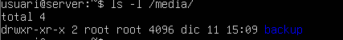

Quan hem fet el pas anterior hem de donar-li format al disc, tot aixo es fa amb l'eina fdisk, ara abaix us deixare el primer pas

```bash
sudo apt install fdisk
```
Quan hem fet el pas anterior seguidament  posarem fdisk -l per visualitzar el disc

```bash
fdisk -l
```

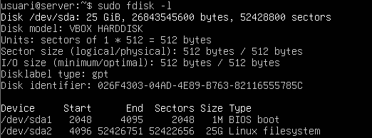

Com es veu el disc 2 esta , osigui que el el proxim pas sera crear el seu volum, per realitzar aixo posarem  la comanda pvcreate, avans de fer servir aquesta comanda primer instalarem lvm2

```bash
sudo apt install lvm2
```

Quan ja hem fet aixo ja podrem crar el volum

```bash
pvcreate /dev/sdb
```

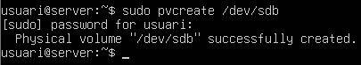

Quan ja estigui tot montat hem de resetejar-lo amb la comanda que deixare abaix

```bash
mkfs.xfs -f /dev/sdb
```

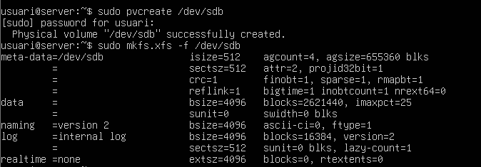

Per finalitzar hem de muntar el disc a la carpeta que hem creat anteriorment,ho farem amb la seguent comanda.

```bash
mount /dev/sdb /media/backup
```
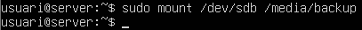

Quan ja esta el disc muntat hem de instalar el duplicity

```bash
apt install duplicity -y
```

Ara hem de crear uns cuants usuaris que disposin de carpeta personal i seguidament crearem 4 arxius de 10 MB que estaran a la carpeta home

ho farem de la seguent manera

```bash
useradd -m -s /bin/bash user1
```

```bash
useradd -m -s /bin/bash user2
```
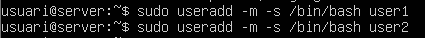
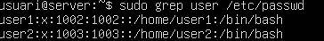

```bash
fallocate -l 10MB file1
fallocate -l 10MB file2
fallocate -l 10MB file3
fallocate -l 10MB file4
```
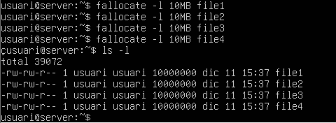


Quan ja hem creat els arxius ara hem de fer la copia de seguretat, tot aixo es fa amb el duplicity

La comanda per fer una copia de seguretat completa de la carpeta home sera la seguent.Per fer la copia de seguretat completa de la carpeta home ho farem amb la seguent comanda.

```bash
duplicity full /home/user file:///media/backup/
```
Quan ens demani el passphrase hem d'escollir el que nosaltres volguem, ja que és una simple proba

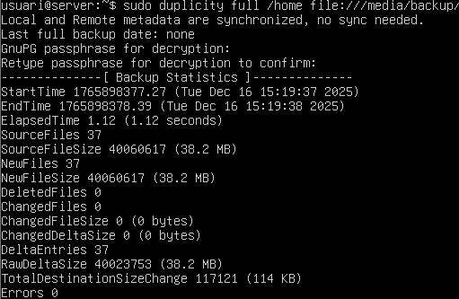

Com es veu la copia esta ben feta i creada , això amb la comanda ls

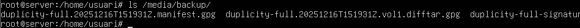
Ara hem de borrar tots els arxius i hem de comprobar si funciona

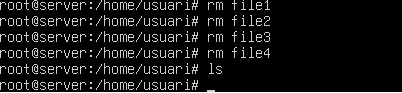

Quan ja no els veiem utilitzarem la copia,hem de guardar la copia dins d'una carpeta que es diu copia dins de la carpeta ```/home/user``` tot aixo es fara amb la comanda que deixo abaix

```bash
duplicity restore file:///media/backup/ /home/user/copia
```

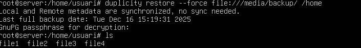

Ara hem de fer una copia incremental, per fer-ho hem de crear un arxiu de 4mb
Farem un arxiu de proba

```bash
fallocate -l 4MB file5
```

Ara amb la comanda d'abaix farem la copia

```bash
duplicity /home file:///media/backup/
```

No fa falta la opció full perque es una copia incremental

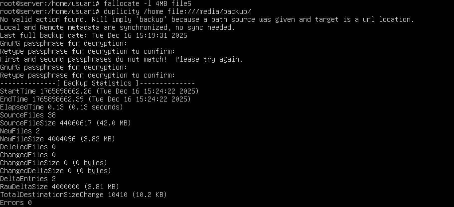

Ara farem un script perque les copies es fagin automatiques

Ara hem de desmuntar el disc,es fara ambv la comanda que deixo abaix

```bash
umount /media/backup
```

Ara crearem l'script, hem de fer un nou arxiu que es dira```fullbackup.sh```
Quan estigui  creat hem d'escriure el seguent:

```bash
!/bin/bash

export PASSPHRASE="usuariusuari1234"

mount /dev/sdb /media/backup

duplicity full /home file:///media/backup/homebackup

umount /media/backup
```

Això sera perque per si sol al principi monti el disc fagi la copia i al acabar la copia desmonti el disc, aixi asseguran que el disc unicament estara montat durant el moment de fer la copia

Quan estigui fet hem de donar permisos de execusió a l'arxiu

```bash
chmod +x fullbackup.sh
```

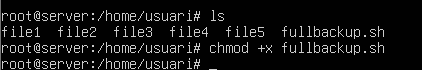

Ara hem de modificar l'arxiu crontab per  poder configurar que l'script s'executi cada diumenge a les 23:00

Per poder arribar a aquest arxiu s'ha d'utilitzar la seguent comanda

```bash
crontab -e
```

Un cop dins afegirem aquesta linia 

```bash
0 23 * * 0 /home/usuari/fullbackup.sh
```

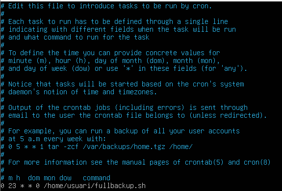

A continuació farem l'script de copia incremental, per començar crearem l'arxiu anomenat ```incrementalbackup.sh```

Un cop dins escriurem el seguent 

```bash
!/bin/bash

export PASSPHRASE="usuariusuari1234"

mount /dev/sdb /media/backup

duplicity incremental /home file:///media/backup/homebackup

umount /media/backup
```

Un cop fet això tornem a donar-li permisos 

```bash
chmod +x fullbackup.sh
```

Per ultim tornem a editar l'arxiu crontab en el qual afegirem la seguent linia

```bash
0 23 * * 1-6 /home/usuari/incrementalbackup.sh
```

Quedant algo aixì

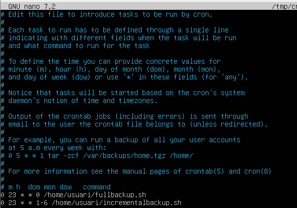
