## TASCA 06

**El primer pas sera anar a la nostra maquina windows i obrir la configuració de escriptori remot**

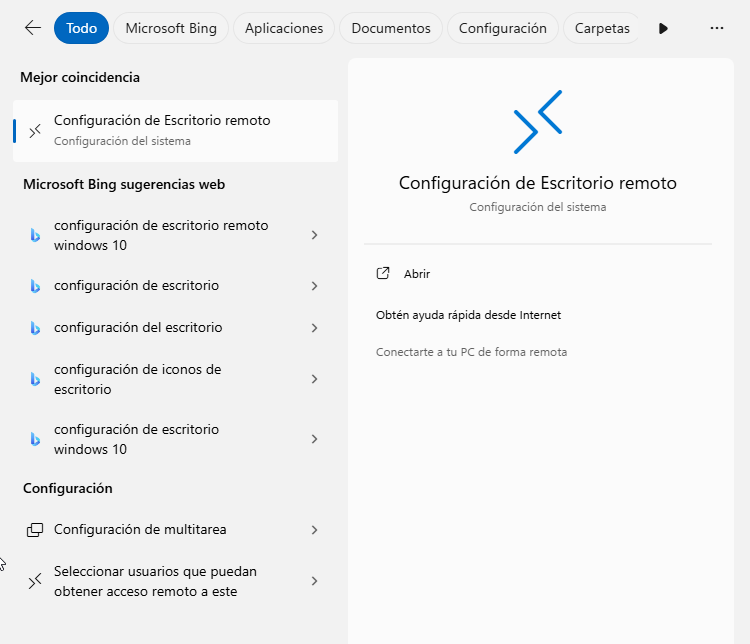

**Seguidament ara hem d'activar l'opció de Escritorio Remoto**

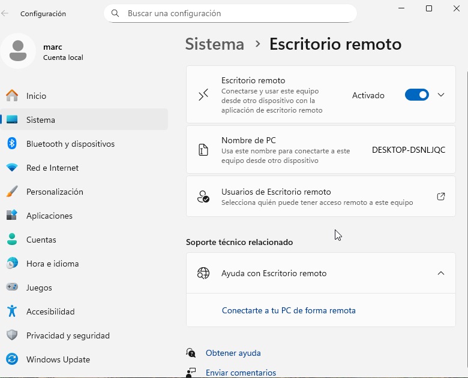
## Configuració maquina zorin

**Hem d'anar a configuració i despres a remote desktop**

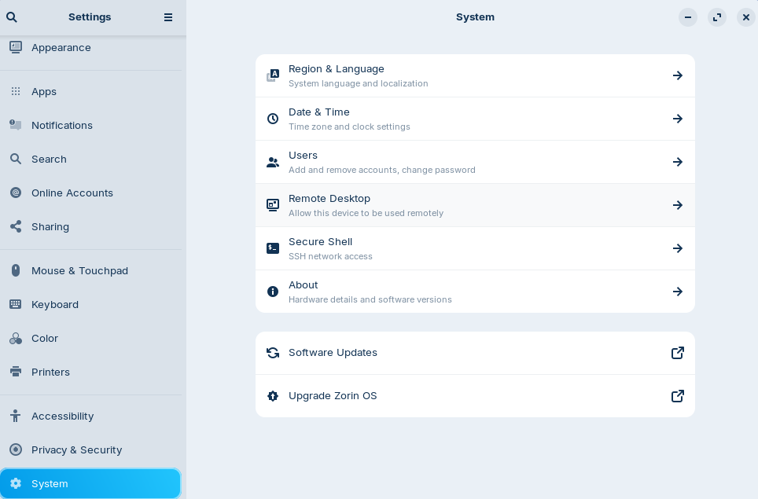

**Ara hem d'activar l'opció de Desktop Sharing i Remote Control**

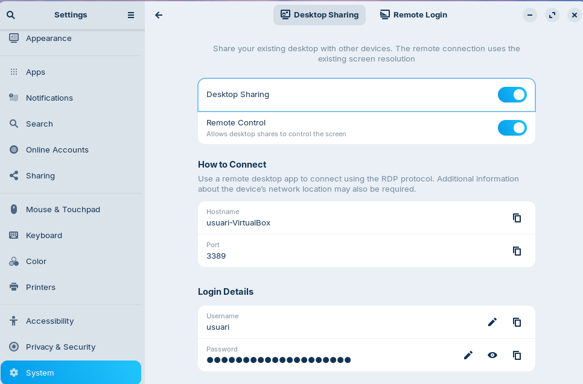

**Hem de substituir la contrasenya que posa per defecte**

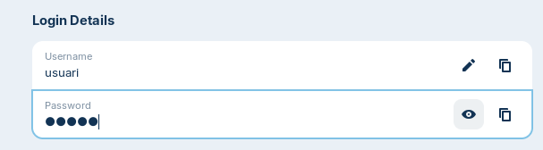

**Ara cambiem a la màquina Windows i hem d'obrir l'apartat de Conexion a Escritorio Remoto**

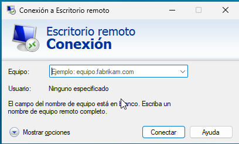

**Obrim terminal de la maquina zorin i posem:ip a i despres posem la posem a la maquina windows**

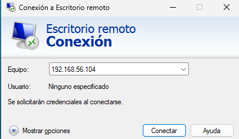

**Posem les credencials**

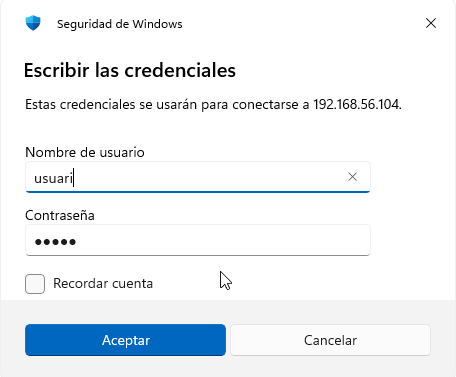

**Acceptem l'advertencia**

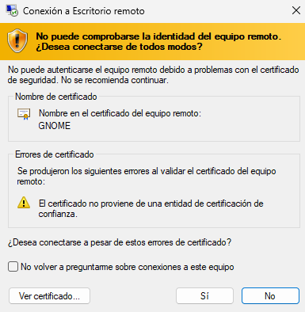

**Com veiem ja estem conectats a la maquina**

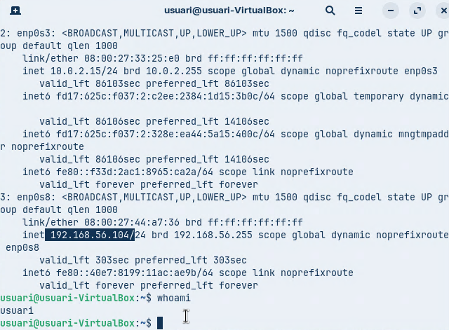

## Ara ho farem a la inversa  ens hem de connectar desde la màquina Zorin a Windows

**Busquem rommina i l'obrim**

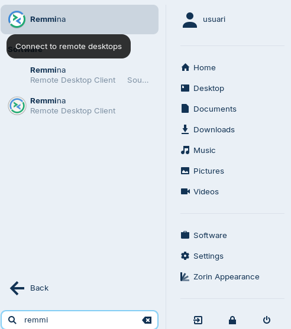

**Busquem ip a la maquina windows i introduim la ip**

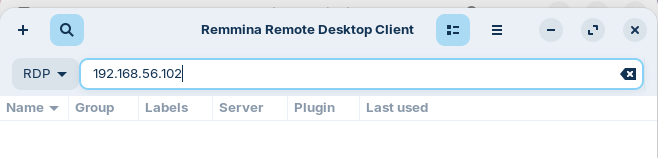

**Posem les credencials**

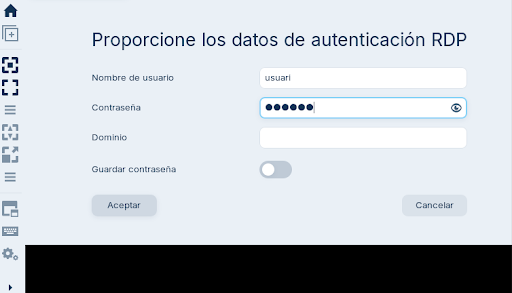

**Com es veu ja estariem a l'escritori de Windows**

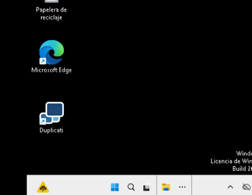
