# Projecte04: Servidor NFS

## El Cas Client:  DevOptimize Solutions

El nostre client, `DevOptimize Solutions`, és una petita startup de desenvolupament de programari que treballa exclusivament amb Linux. Tenen un problema crític: el seu codi font i els seus actius (documents de disseny, scripts) estan descontrolats. Cada desenvolupador té còpies locals, cosa que provoca errors de versió constants i una pèrdua d'eficiència brutal.
Ens han contractat per implementar un servidor de fitxers centralitzat. Atès que tot l'entorn és Linux, la solució nativa, més ràpida i eficient del sector és NFS (Network File System).
El client ha insistit en que treballa sense un entorn d’autenticació centralitzada i que, de moment, no té previst fer aquest pas.

Per mostrar al client com quedarà la solució proposada a partir de les seves demandes i poder mostrar també les seves limitacions, se t’encarrega fer una demostració del sistema.

Crearàs un servidor NFS (NFSv3) i un client Linux que consumeixi els recursos compartits. Hauràs de crear usuaris i grups per simular l'entorn del client i demostrar el control d'accés utilitzant les opcions d'exportació (/etc/exports) i els permisos del sistema de fitxers (chmod, chown).


---

Per començar  aquesta guia hem d'instalar 2 maquines, un ubuntu server i un zorin per simular el client.

Quan que ja tenim les dues maquines instalades començarem configurant el servidor.

Primer de tot actualitzarem els paquets

```bash
sudo apt update && sudo apt upgrade -y 
```
Quan ja hem actualitzat els paquets, lo seguent sera començar amb la creació de l'estructura de carpetas, de grups i usuaris.

El primer que farem sera crear els grups neccesaris, en aquest cas en demana que creem 2 grups, el primer devs i el segon admin

Per crear aquest grups farem la seguent comanda 

```bash
groupadd devs
```

```bash
groupadd admin
```


Per comprobar que l'arxiu s'ha creat correctament farem servir el greep per buscar tant el grup devs com admin dins de l'arxiu /etc/groups, per fer-ho farem la seguent comanda

```bash
grep devs /etc/group
```

Per comprobar que l'arxiu s'ha creat correctament farem servir el greep per buscar tant el grup devs com admin dins de l'arxiu /etc/groups, per fer-ho farem la seguent comanda

```bash
grep devs /etc/group
```

```bash
grep admin /etc/group
```

Podem veure si els grups estan creats correctament

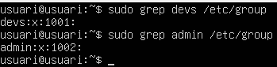

Quan ja tenim els grups creats ara hem de fer  l'usuari dev01 que formi part del grup devs, per fer això farem servir la seguent comanda

```bash
useradd -G devs -m -s /bin/bash dev01
```

Ara farem el mateix per l'usuari admin01, en la qual farem la seguent comanda

```bash
useradd -G admin -m -s /bin/bash admin01
```

Per confirmar que estan creats correctament tornarem a fer servir el grep

```bash
grep dev01 /etc/passwd
```

```bash
grep admin01 /etc/passwd
```

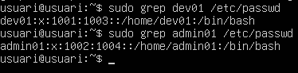

 Ara que ja hem creat els grups i els usuaris, el seguent  sera crear el directori per als projectes de desenvolupament en la qual la ruta que ens demana és la seguent /srv/nfs/dev_projects, per crear les totes les carpetas d'una sola comanda farem el seguent:

```bash
mkdir /srv/nfs/dev_projects -p
```

Un cop fet això crearem el directori per a les eines d'administració en la qual la ruta sera /srv/nfs/admin_tools

```bash
mkdir /srv/nfs/admin_tools
```

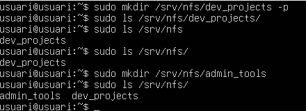
Per ultim configurarem els permisos de les carpetas, en aquest cas seran els seguent.

Chown per canviar la propietat de la carpeta

```bash
chown root:devs /srv/nfs/dev_projects
```

```bash
chown root:admin /srv/nfs/admin_tools/
```

Un cop fet això assignare els permisos de la carpeta amb la comanda chmod

```bash
chmod 770 /srv/nfs/dev_projects
```

```bash
chmod 770 /srv/nfs/admin_tools
```

Per comprobar que els permisos estan correctes farem ls -l per poder veure els permisos de cada carpeta

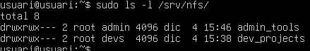

Avans de continuar amb el servidor crearem els grups i usuaris dins de la maquina client, en aquest cas una maquina zorin.

Per poder crear els grups i usuaris farem servir la aplicació "users and groups"

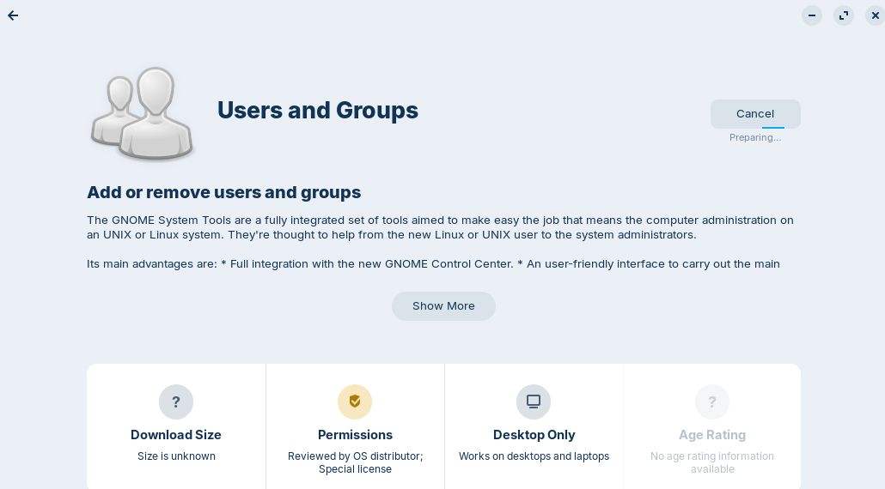

Per comporbar que tots els grups s'han creat correctament farem servir el grep tal i com hem fet avans

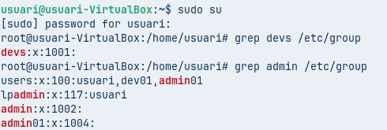
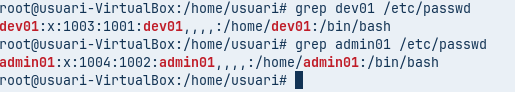

Hem de comprobar que els numeros UID i GID (els números d'identificació) coincideixin a les dues màquines.

Un cop fet això instalarem els paquets neccesairs del servei NFS al servidor, per fer això farem la seguent comanda

```bash
apt install nfs-kernel-server -y
```
Per comprobar que s'ha instalat correctament podem fer un systemctl status

```bash
systemctl status nfs-kernel-server
```

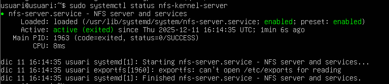

Per començar editarem l'arxiu /etc/exports per poder decidir quins arxius volem exportar, en aquest cas volem exporta tota la carpeta /srv/nfs

Afegirem una linia adicional al final del arxiu, en aquest cas sera la seguent 

```bash
/srv/nfs *(rw,sync,no_subtree_check)
```
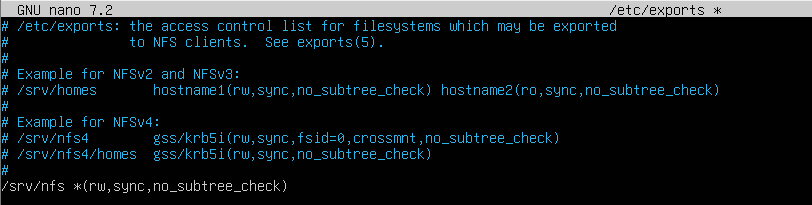

Per poder aplicar el canvis haurem de reinciar el servei amb la comanda

```bash
systemctl restart nfs-kernel-server
```
Un cop fet això l'iniciem i comprobarem que tot funciona correctament 

En el servidor podem fer la comanda 

```bash
exportfs -u
```
Amb la qual podrem veure quins arxius es poden exportar

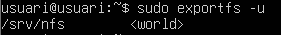

Tambe podem fer la seguent comanda per veure des-de quin port treballa, en aquest cas ho fa amb el port 2049

```bash
rpcinfo -p 192.168.56.101
```
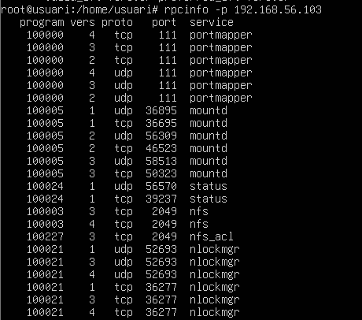

Per poder comprobar en la maquina haurem d'instalar el paquet nfs-common, això ho farem amb la seguent comanda

```bash
sudo apt install nfs-common -y
```

Un cop fet això en conectarem al servidor amb la comanda showmount -e IP

En el meu cas sera la seguent comanda 

```bash
showmount -e 192.168.56.101
```

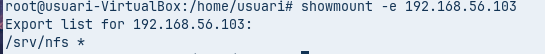

En la qual podem veure que la carpeta /srv/nfs

---

# Fase 3: L'Exportació d'Administració (El Dilema del root_squash)

A continuació farem una prova 1 (L'error comú)

Previament ja hem exportat l'arxiu /srv/nfs per tant el seguent pas que hem de fer sera muntar aquest recurs a la carpeta /mnt/admin_tools, en un principi aquesta carpeta no existeix, per tant el primer pas sera crear-la, això ho farem amb la seguent comanda

```bash
mkdir /mnt/admin_tools 
```

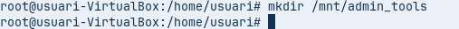

Quan ja tenim creada la carpeta, seguidament muntarem el recurs, això ho farem amb la comanda mount 

```bash
mount -t nfs 192.168.56.101:/srv/nfs/admin_tools /mnt/admin_tools
```

Nomes podem veure no podem crear cap arxiu ja que no tenim els pemisos ja que el root de la maquina client i el root del servidor no es el mateix

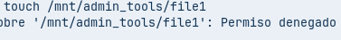

En canvi si intentem crear un arxiu amb l'usuari admin si que es podria realitzar, perque aquest usuari si que te permisos en aquesta carpeta

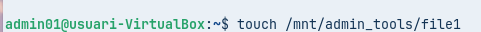

Com veiem l'arxiu que hem creat es propietat de admin01

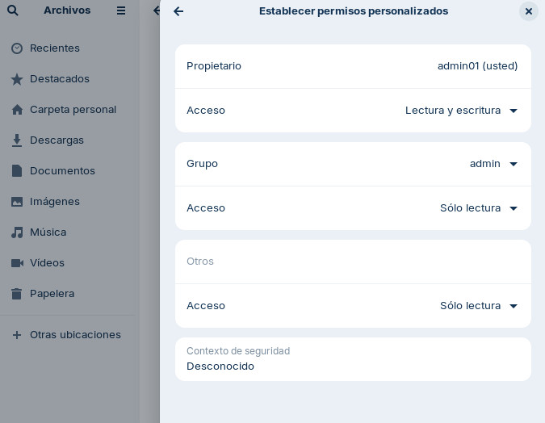

Ara us mostrare com fer per poder crear arxius amb root

Prova 2 (La Solució)

Primer haurem d'editar l'arxiu /etc/exports  hem de  substituir la linia que hem escrit previament per les seguents.

```bash
/srv/nfs/admin_tools *(rw,sync,no_subtree_check,no_root_squash)
/srv/nfs/dev_projects *(rw,sync,no_subtree_check)
```

Quan hem fet això hem de reiniciar el servei un altre cop amb la comanda 

```bash
systemctl restart nfs-kernel-server
```

Ara hem de desmuntar i muntar un altre cop el recurs, la comanda per desumntar es

```bash
umount -t nfs 192.168.56.101:/srv/nfs/admin_tools /mnt/admin_tools
```
I per muntar

```bash
mount -t nfs 192.168.56.101:/srv/nfs/admin_tools /mnt/admin_tools
```

Quan hem fet això ja podem crear un nou arxiu,en aquest cas he creat una arxiu anomenat file2

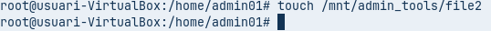

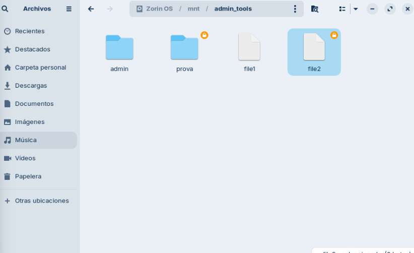

Això a causa de que hem modificat l'arxiu /etc/exports fent que el root de la maquina fisica sigui el mateix que el root del servidor, per tant tenim total llibertat 

---

# Fase 4: L'Exportació de Desenvolupament (Permisos rw vs ro)

Ara el client ens diu el seguent la xarxa d'administració (p.ex., 192.168.56.0/24) hi pugui escriure, però que la xarxa de consultors (p.ex., 192.168.56.100) només pugui llegir.

Per poder fer això hauriem de modificar l'arxiu /etc/exports i substituir la linia "/srv/nfs/dev_projects *(rw,sync,no_subtree_check)" per les seguents 

```bash
/srv/nfs/dev_projects 192.168.56.0/24(rw,sync,no_subtree_check)
/srv/nfs/dev_projects 192.168.56.140(ro,sync,no_subtree_check)
```
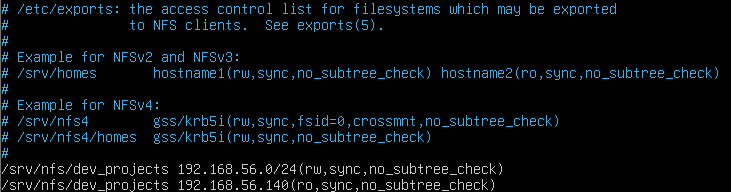

Això ho fem degut a que  per poder assignar permisos depenen de la ip que tingui l'usuari

Ara hem  reinciar el servei amb la comanda 

```bash
systemctl restart nfs-kernel-server
```
Quan fem aixo  hauriem de muntar el disc dev_projects per comprobacions

Primer crearem la carpeta amb aquesta comanda

```bash
mkdir /mnt/dev_projects
```

Seguidament modificarem la nostre ip, posarem la ip ```192.168.56.128``` per poder fer això anirem a la configuració de xarxa i colocarem la ip manualment i muntarem el disc

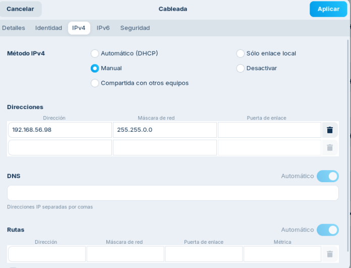

Quan hem fet això si posem el login l'usuari dev01 degut a que tenim una ip dins del rang que pot editar dins de la carpeta si que podrem crear arxius

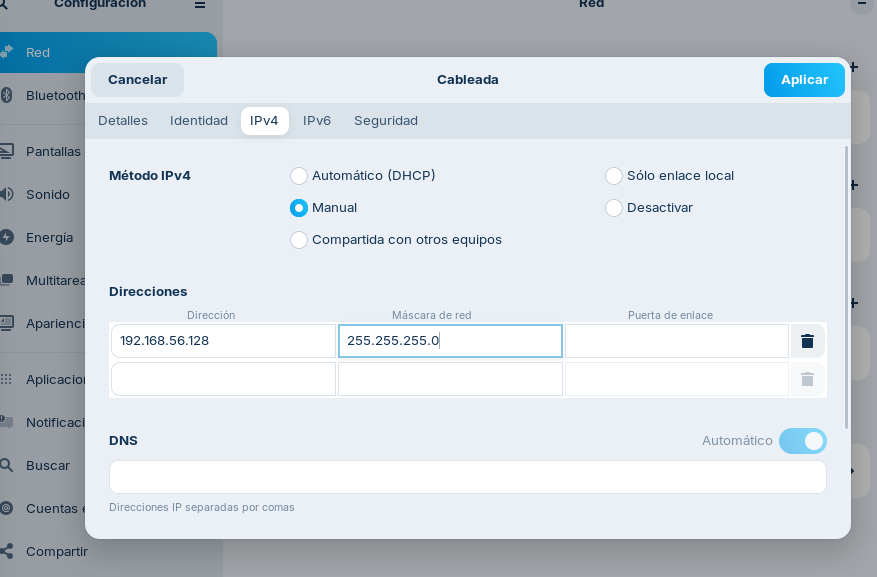


De mentres que canviem la ip ```192.168.56.140``` podem veure que no es pot editar els arxius però en canvi podem veure que hi ha a la carpeta, ara hem de tornar a desmuntar i muntar el disc

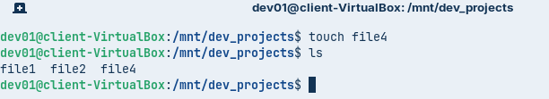


Podem accedir a la carpeta i veure que hi ha dins però no podrem modificar el contigut perque nomes tenim permisos de lectura


Per finalitzar hem de fer login amb l'usuari admin01 i seguidament intentar crear un arxiu en la carpeta dev_projects

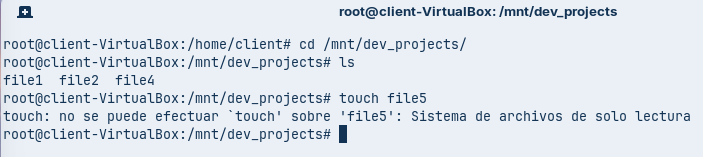


 Com es veu no podem crear ningun arxiu dintre de la carpeta dev_projects perque no tenim els permisos principals, degut a que l'usuari admin01 no forma part del grup dev01

---

# Fase 5: Muntatge Automàtic amb /etc/fstab

Seguidament hem de cambiar l'arxiu /etc/fstab per aixi configurar que els recursos compartits no es tinguin que muntar de nou

El proxim pas es, fer la següent comanda per poder accedir a l'arxiu

```bash
sudo nano /etc/fstab
```

hem d'afegir aquestes dues lines al final

```bash
192.168.56.103:/srv/nfs/admin_tools /mnt/admin_tools nfs defaults 0 0
192.168.56.103:/srv/nfs/dev_projects /mnt/dev_projects nfs defaults 0 0
```
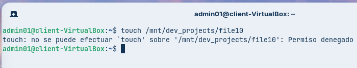

Quan estigui fet reiniciem la màquina i confirmem que discos s'han muntat correctament 

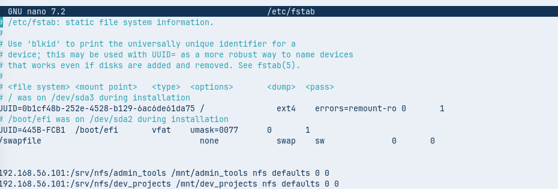

---

# Conclusió

Per millorar aquest producte es podrien canviar alguns aspectes. Un dels principals problemes és que els usuaris i els grups s’han de crear tant al servidor com a cada ordinador client, cosa que no és pràctica. En un entorn real amb més de 20 ordinadors, això obligaria a repetir el mateix procés moltes vegades.

Una possible solució seria tenir els usuaris i grups en un sol lloc, per exemple utilitzant LDAP. Així s’evitaria fer la mateixa feina una i altra vegada i la gestió seria molt més senzilla.
